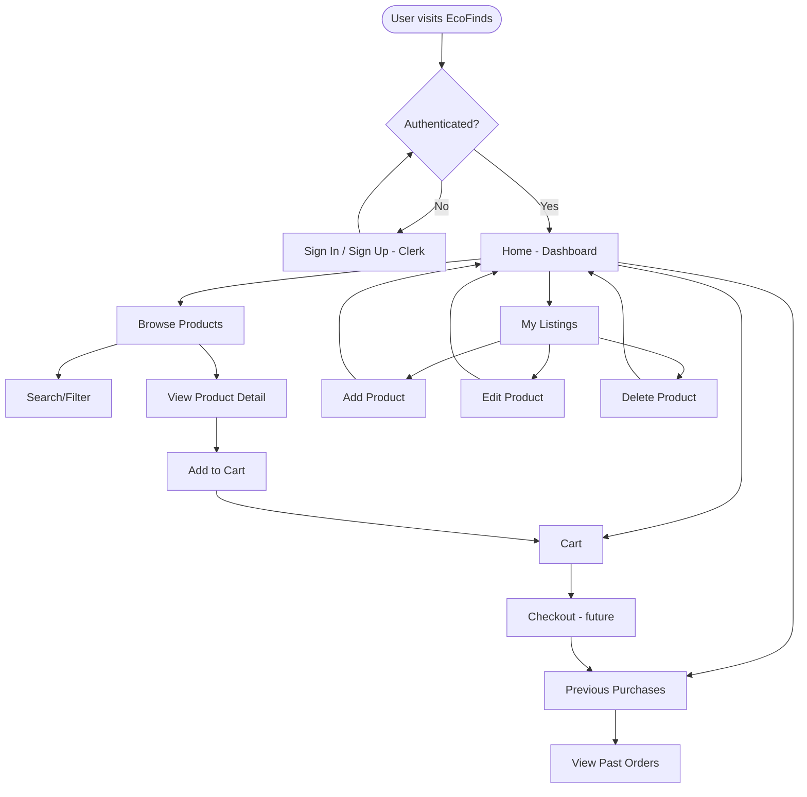

# 🌱 **EcoFinds — Sustainable Second-Hand Marketplace**

> _Empowering Sustainable Consumption, One Unique Find at a Time._

---

## 👋 Introduction

**EcoFinds** is a modern, community-driven platform for buying and selling second-hand products with sustainability at its core. Designed to reduce waste and promote conscious consumption, EcoFinds provides users with an intuitive, secure, and aesthetically pleasing marketplace to discover and share unique, pre-loved items.

---

## 🎯 **Vision**

EcoFinds aims to:

- Foster a circular economy by encouraging the reuse of goods
- Make sustainable choices accessible to everyone
- Build a trusted community of environmentally conscious users
- Be the go-to platform for second-hand treasures and responsible consumption

---

## 🚀 **Key Features**

- 🔐 **User Authentication:** Secure login and registration with Clerk (email/password and social login)
- 👤 **User Profiles:** Create profiles with usernames and profile pictures
- 📦 **Product Listings:** Add, edit, view, and delete listings with title, description, category, price, and image
- 🔍 **Smart Browsing:** Search bar, category filters, and full product feed
- 📄 **Product Details:** Individual product pages with full descriptions
- 🛒 **Cart System:** Add items to a cart (UI in place; persistent cart coming soon)
- 💸 **Purchase History:** Track your purchases (UI ready; backend logic in progress)
- 📱 **Responsive Design:** Fully responsive layout for mobile and desktop
- 🧑‍💼 **User Dashboard:** View user details (editing profile coming soon)

---

## 🧑‍💻 Team Members

Meet the developers behind EcoFinds:

| Avatar                                                                                                    | Name                             | GitHub                                       |
| --------------------------------------------------------------------------------------------------------- | -------------------------------- | -------------------------------------------- |
|  | **Ankit Kumar Singh** _(Askit)_  | [@AskitEndo](https://github.com/AskitEndo)   |
|  | **Sneha Priyadarshy** _(Darpan)_ | [@DarpanEndo](https://github.com/DarpanEndo) |
|   | **Yash Raghav** _(Fr0Sen)_       | [@Fr0nSen](https://github.com/Fr0nSen)       |

---

## ⚙️ **Tech Stack**

- **Framework:** Next.js (App Router, SSR, and API routes)
- **Database:** SQLite via Prisma ORM
- **Styling:** Tailwind CSS + `shadcn/ui` components
- **Auth:** Clerk (secure user login, sessions, and management)
- **Validation:** Zod for form and API schema validation
- **UI Effects:** react-parallax for engaging hero section
- **Media Handling:** ImageKit-ready (currently using static URLs)

---

## 🗺️ **Application Flow**



---

## 🛠️ **Setup Instructions**

Follow the steps below to get EcoFinds running locally:

1. **Install dependencies**

```bash
npm install
# or
yarn install
# or
pnpm install
# or
bun install
```

2. **Generate Prisma Client**

\`\`\`bash
npx prisma generate

````

> If you encounter the error:
> `@prisma/client did not initialize yet...`
> Run the command above and restart the dev server.

3. **Run the development server**

```bash
npm run dev
# or
yarn dev
# or
pnpm dev
# or
bun dev
````

4. **Visit:** [http://localhost:3000](http://localhost:3000)

---

## 📋 **Hackathon Requirements Covered**

- ✅ User authentication and profile creation
- ✅ Product listing (Create, Read, Update, Delete)
- ✅ Search, filters, and full product feed
- ✅ Product detail pages
- ✅ UI for cart and purchase history (functionality in progress)
- ✅ Fully responsive user interface
- ✅ User dashboard with profile view

---

## 🔥 **Next Steps & Improvements**

- 🎉 **Toast Notifications** – Add user feedback with `react-hot-toast`
- ✏️ **Editable Product Listings** – Pre-filled form for updating listings
- 💀 **Skeleton Loaders** – Improve UX during data fetches
- 🎨 **Custom Clerk Theme** – Align auth pages with EcoFinds branding
- 🛒 **Persistent Cart & Checkout Flow** – Implement full e-commerce flow
- 👤 **Editable User Profiles** – Update user info from dashboard
- 📢 **Real-Time Updates & Alerts** – Live activity feedback

---

## 🖼️ **Hero Section with Parallax**

The homepage uses a **parallax effect** (via `react-parallax`) featuring the EcoFinds logo for a modern and captivating landing experience.

Image path: `/public/ecofindslogo_nobg.png`

---

## 🔐 **Security & Access Control**

- All backend operations are guarded using Clerk's `auth()`
- Only authenticated users can create or modify listings
- Database actions are secured via Prisma

---

## 🧱 **Technical Architecture Overview**

\`\`\`plaintext
Client (Next.js)
│
├── Auth (Clerk)
├── UI (shadcn/ui + Tailwind)
│
└── API Routes
├── User Auth & Profile
├── Product CRUD
├── Cart & Purchase (upcoming)
└── Prisma ORM (SQLite)

```

---

## 🏁 Final Note

EcoFinds is a hackathon project built with purpose — to **inspire sustainable habits**, reduce consumer waste, and make second-hand shopping seamless, fun, and impactful.

_Crafted with 💚 by Ankit, Sneha, and Yash._

---

Let me know if you'd like a downloadable version (e.g., `.md` file), or if you want help deploying or extending any part of this project.
```
